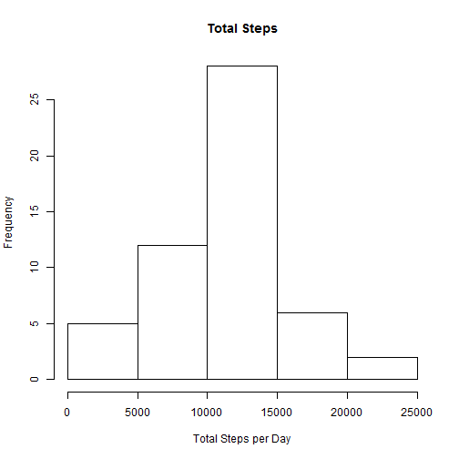
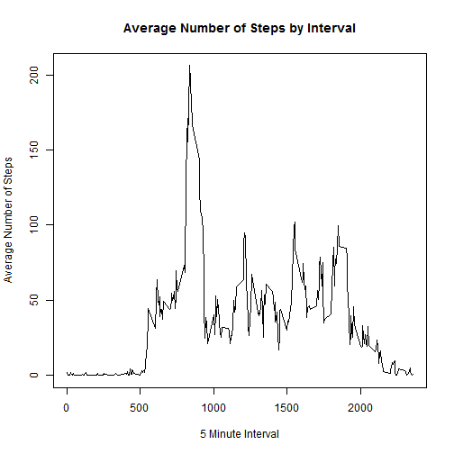
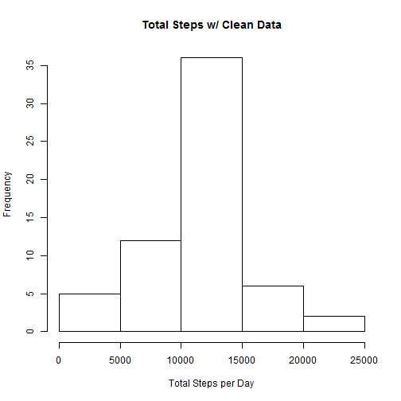
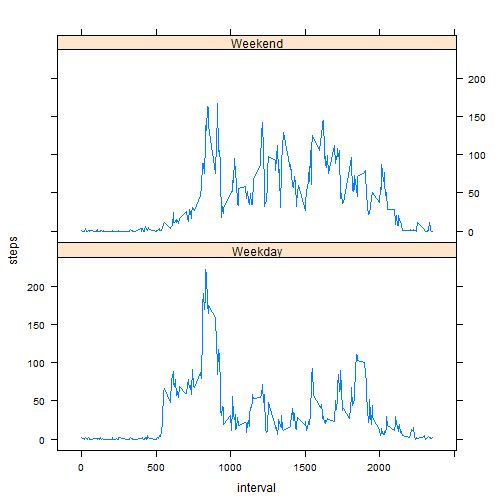

#Peer Assignment #1

##Loading the Data

This next code chunk will be loading in the data for this analysis and transforming the date column to date type


```r
data <-read.csv("C:/Users/wmorton/Documents/Coursera_Data_Science/Reproducible_Research/PeerProject1/activity.csv", stringsAsFactors = FALSE)
library(plyr)
```

##Mean Number of Steps by Day 

This code will complete three tasks:

- Calculate the total number of steps taker per day.

- Create a histogram for total number of steps by day.

- Calculate the mean and median of total number of steps taken per day and show the first 5 entries for both mean and median.
  
  

```r
total_steps <- aggregate(steps ~ date, data, sum)
hist(total_steps$steps, main = "Total Steps", xlab = "Total Steps per Day")
```

 

```r
mean_steps <-mean(total_steps$steps, na.rm = TRUE)
print(mean_steps)
```

```
## [1] 10766.19
```

```r
median_steps <- median(total_steps$steps, na.rm = TRUE)
print(median_steps)
```

```
## [1] 10765
```

##Average Daily Activity Pattern

This code calculates the mean of the steps per 5-minute interval for each day and then create a plot showing this and which interval had the highest mean.


```r
Avg_int_steps <- aggregate(steps ~ interval, data, mean)
plot(Avg_int_steps$interval, Avg_int_steps$steps, type = "l", xlab = "5 Minute Interval", ylab = "Average Number of Steps", main = "Average Number of Steps by Interval")
```

 

```r
Avg_int_steps[which.max(Avg_int_steps$steps),] 
```

```
##     interval    steps
## 104      835 206.1698
```

##Imputing Missing Values

This code will doing the following:

- Calculate the total number of missing values.

- Devise a strategy to fill in the missing values.

- Create a new data set that will be the same as the original data set, but no missing values.

- Make a histogram of the total numbers of steps taken each day and calculate the and report the mean and median total number of steps taken          per day.


```r
sum(is.na(data$steps))
```

```
## [1] 2304
```

```r
impute.mean <- function(x) replace(x, is.na(x), mean(x, na.rm = TRUE))
data_cln <- ddply(data, ~ interval, transform, steps = impute.mean(steps))
data_cln <- data_cln[order(data_cln[,"date"], data_cln[,"interval"]),]
data_cln <- data.frame(data_cln, row.names=NULL)

total_steps_cln <- aggregate(steps ~ date, data_cln, sum)
hist(total_steps_cln$steps, main = "Total Steps w/ Clean Data", xlab = "Total Steps per Day")
```

 

```r
mean_steps_cln <- mean(total_steps_cln$steps, na.rm = TRUE)
print(mean_steps_cln)
```

```
## [1] 10766.19
```

```r
median_steps_cln <- median(total_steps_cln$steps, na.rm = TRUE)
print(median_steps_cln)
```

```
## [1] 10766.19
```

```r
mean_difference <-round(abs(mean_steps_cln - mean_steps), digits = 2)
print(mean_difference)
```

```
## [1] 0
```

```r
median_difference <-round(abs(median_steps_cln - median_steps), digits = 2)
print(median_difference)
```

```
## [1] 1.19
```

From this analysis you can see that quite a bit has changed within the histogram the instances of # of steps by day from 1000-1500 has increased. The mean from the original data set to the clean data set has gone unchanged and median numbers of the clean data set has risen by 1.19 steps. 

##Weekday Analysis

This code will do the following: 

- Determine what day of the week a specific data is. 

- Add column that indicates if that day of the week is a weekday or weekend.

- Create a panel plot that shows the average number of steps by interval for weekdays vs. weekends.


```r
data_cln$date <- strptime(data_cln$date, "%Y-%m-%d")
data_cln<-mutate(data_cln, day_of_week = weekdays(date))
data_cln$weekday_weekend[data_cln$day_of_week %in% c("Monday","Tuesday", "Wednesday", "Thursday", "Firday")] <- "Weekday"
data_cln$weekday_weekend[data_cln$day_of_week %in% c("Saturday","Sunday")] <- "Weekend"
data_cln<- transform(data_cln, weekday_weekend = factor(weekday_weekend))
avg_steps_weekd <- aggregate (steps ~ interval + weekday_weekend, data_cln, mean)
library(lattice)
xyplot(steps ~ interval | factor (weekday_weekend), data = avg_steps_weekd, type = "l", layout=c(1,2))
```

 
